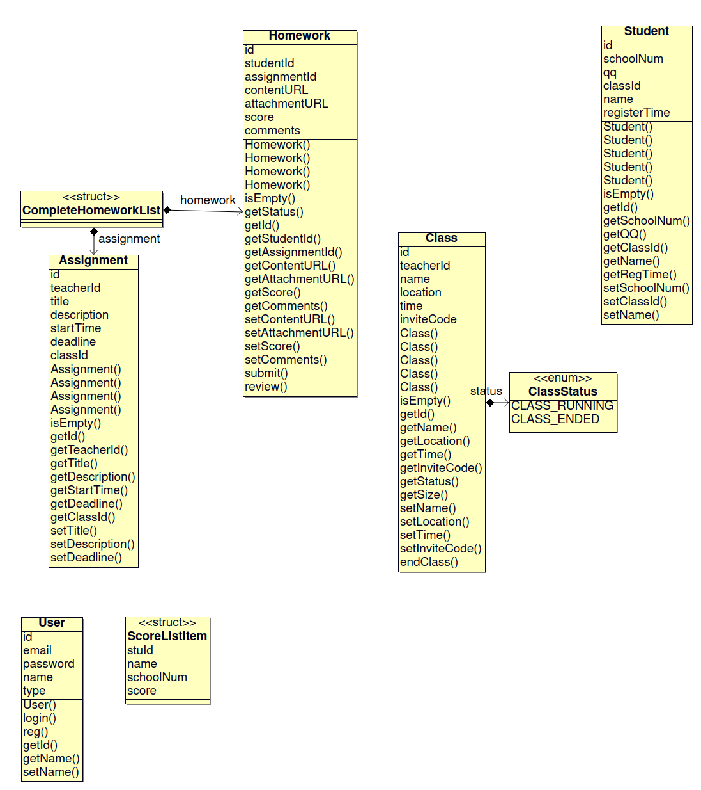

# DataManager

## 整体功能
DataManager模块作为沟通教师端、学生端和后端的类库，负责对数据库操作进行抽象，并在此基础上管理整个项目需要用到的数据，包括帐号、班级、学生、教师、作业、成绩等。

## 项目结构

### 引用
- MySQL *(第三方库)*
- OpenSSL *(第三方库)*

### 整体构成

注：DataManager既是子项目名也是其中一个子模块的名称

```
DataManager  数据管理项目  负责人：林思行
├─ DMTest  DataManager测试
│    └─ main.cpp
└─ DataManager
     ├─ CMakeLists.txt
     ├─ DBManager.cpp
     ├─ DBManager.hpp  数据库操作函数
     ├─ DMError.cpp
     ├─ DMError.hpp  DataManager操作异常类
     ├─ DMUtils.cpp
     ├─ DMUtils.hpp  DataManager实用工具
     ├─ DataManager.cpp
     └─ DataManager.hpp  DataManager数据管理类库
```

### 层次关系

#### DataManager




## 关键技术

### 数据库

为了更高效、稳定地储存数据和查询数据，本次大作业使用了在业界广泛使用的MySQL数据库。

#### 数据库表设计

- 帐号表（users）

| 字段     | id   | username    | password    | type                       | avatar_url                          | name        |
| -------- | ---- | ----------- | ----------- | -------------------------- | ----------------------------------- | ----------- |
| 数据类型 | INT  | VARCHAR(50) | VARCHAR(50) | TINYINT(1)                 | VARCHAR(100)                        | VARCHAR(15) |
| 描述     |      | 用户名      | 密码        | 用户类型（0=教师，1=学生） | 头像URL（由于时间关系已去除此功能） | 教师姓名    |

- 布置的作业表（assignments）

| 字段     | id     | teacher_id   | title       | description | start_date | deadline  | class_id   |
| -------- | ------ | ------------ | ----------- | ----------- | ---------- | --------- | ---------- |
| 数据类型 | BIGINT | INT          | VARCHAR(80) | TEXT        | TIMESTAMP  | TIMESTAMP | INT        |
| 描述     |        | 布置的教师ID | 标题        | 描述        | 布置时间   | 截止时间  | 目标班级ID |

- 提交的作业表（homework）

| 字段     | id     | student_id | assignment_id | content_url  | attachment_url | score    | comments |
| -------- | ------ | ---------- | ------------- | ------------ | -------------- | -------- | -------- |
| 数据类型 | BIGINT | INT        | BIGINT        | VARCHAR(600) | VARCHAR(600)   | SMALLINT | TEXT     |
| 描述     |        | 学生ID     | 布置的作业ID  | 作答文件URL  | 附件URL        | 成绩     | 评语     |

- 班级表（classes）

| 字段     | id     | teacher_id | name        | location    | time        | code    | status             |
| -------- | ------ | ---------- | ----------- | ----------- | ----------- | ------- | ------------------ |
| 数据类型 | BIGINT | INT        | VARCHAR(25) | VARCHAR(20) | VARCHAR(10) | CHAR(4) | TINYINT(1)         |
| 描述     |        | 教师ID     | 名称        | 上课地点    | 上课时间    | 邀请码  | 0=未结课，1=已结课 |

- 学生表（students）

| 字段     | id   | school_num | qq          | class_id | name        | register_time |
| -------- | ---- | ---------- | ----------- | -------- | ----------- | ------------- |
| 数据类型 | INT  | CHAR(11)   | VARCHAR(15) | INT      | VARCHAR(20) | TIMESTAMP     |
| 描述     |      | 学号       | QQ号        | 班级ID   | 姓名        | 注册时间      |


#### DBManager子模块

对MySQL官方提供的MySQL库和MySQL Connector C/C++库进行二次抽象，将连接数据库、查询数据库的操作进行封装，并加入了调试工具，方便对错误进行处理。

提供的函数如下：

```c++
/// 连接数据库
/// @param account 数据库帐号
bool connectDatabase(DBAccount account);

/// 关闭数据库连接并释放查询结果使用的内存
void closeConnection();

/// 检查数据库连接是否仍然可用，如果可用，返回0
int checkConnection();

/// 查询数据库
/// @param queryString SQL语句
/// @returns code 错误代码（0=成功）
int query(std::string queryString);

/// 获取数据
/// @param table 表名
/// @param columnNames 列名（SQL格式）
int select(std::string table, std::string columnNames);

/// 获取数据
/// @param table 表名
/// @param columnNames 列名（SQL格式）
/// @param conditions 条件（SQL格式）
int select(std::string table, std::string columnNames, std::string conditions);

/// 获取数据
/// @param table 表名
/// @param columnNames 列名（SQL格式）
/// @param conditions 条件（SQL格式）
/// @param order 排序方式（SQL格式）
int select(std::string table, std::string columnNames, std::string conditions, std::string order);

/// SELECT操作结果的行数
unsigned long numRows();

/// 获取结果的下一行，等于mysql_fetch_row
MYSQL_ROW fetchRow();

/// 插入数据
/// @param table 表名
/// @param columnNames 列名（以英文逗号分隔）
/// @param values 数据字符串（SQL格式）
int insert(std::string table, std::string columnNames, std::string values);

/// 更新数据
/// @param table 表名
/// @param columnAndValue 列名-值（SQL格式）
int update(std::string table, std::string columnAndValue);

/// 更新数据
/// @param table 表名
/// @param columnAndValue 列名-值（SQL格式）
/// @param conditions 条件（SQL格式）
int update(std::string table, std::string columnAndValue, std::string conditions);

/// 删除数据
/// @param table 表名
/// @param conditions 匹配条件（SQL WHERE语句格式）
int remove(std::string table, std::string conditions);

/// INSERT、UPDATE、DELETE操作影响的行数
unsigned long affectedRowCount();

/// SQL注入检查
/// @param str 要检查的字符串
std::string sqlInjectionCheck(std::string str);
```

#### DataManager子模块

该模块在DBManager的基础上对数据库进行再次抽象，数据库几乎不可见。数据操作转化为`User`、`Class`、`Student`、`Homework`、`Assignment`五个C++类的函数以及DataManager命名空间内的类外函数。抽象之后的类关系参见“层级关系”节。


### 注册登录中对密码的处理

为了避免在网络中传输原始密码，使用了hash函数对密码进行处理，在数据库内存放的仅是密码的哈希值。

生成哈希值的函数：（BKDR算法）

```c++
unsigned int BKDRHash(const std::string str) {
    char *strPtr = const_cast<char *>(str.c_str());
    unsigned int seed = 131;
    unsigned int hash = 0;

    while (*strPtr) {
        hash = hash * seed + (*strPtr++);
    }

    return (hash & 0x7FFFFFFF);
}
```


## 总结

通过负责该模块的设计与编写，了解了SQL数据库的操作，学习了C++的异常机制，并且对较复杂的过程分析的能力有一定提升。

C++下第三方库的使用，由于缺少较成熟的包管理，部分库文件需要下载源码本地编译（本模块中自己编译了OpenSSL库），并且自己添加include path和library path，管理库依赖。经历了非常多的链接错误，结合本学期“计算机系统基础”课程中对链接的介绍，更全面深刻地了解了头文件、静态链接、动态链接。

本模块的优点：

- 抽象程度较高，数据库对上层应用基本不可见
- 类层次简单，耦合度低
- 提供了丰富的调试工具，通过定义DEBUG、VERBOSE宏可以调整输出调试信息的等级

由于时间和能力限制，本模块还有许多不足之处：
- 未实现异步通信，上层应用也未对此进行处理，与服务器通信的时候会阻塞主线程，导致网络差的时候教师端有明显的卡顿
- 异常处理并未完善，DBManager和DataManager的部分函数对异常的处理仅是返回某个特定的非0整数（由MySQL库决定）
- 未实现本地缓存功能，查询请求冗余度较高
- 对SQL注入有一定的防护功能，但仍有办法攻破（限于时间关系仅做了非常简单的处理）