# 总览

## 产品介绍

| **产品定位** | 一款服务于大学教师与学生的教学辅助系统                       |
| ------------ | ------------------------------------------------------------ |
| **产品描述** | 教师可在此系统上布置作业、批改作业、记录成绩；学生可以通过发送邮件到特定QQ号提交作业；教师批改完毕后会将评语和成绩发送至学生的邮箱。期末时教师可以通过此系统一键导出平时成绩。 |
| **目标人群** | 大学教师、学生，尤其是程序设计课的教师和学生                 |
| **使用场景** | 学生提交作业、查看批改结果，教师布置作业、批改作业、记录成绩 |

**要把👆这个表格转成一段文字**

## 产品功能结构

### **学生端**（使用QQ）

- 查看教师布置的作业
- 提交作业
  - 文本
  - 附件
- 查看批改结果
  - 成绩
  - 评语

### 教师端

- 查看学生提交的作业
- 作业打分、写评语
- 查看、导出平时成绩

- 使用数据库储存学生名单、作业、成绩

## 产品特色

- 有简单易用、用户友好的图形界面
- 软件体积小，内存占用低（见“内存使用”章节）
- 跨平台（教师端支持Windows、macOS，服务器端支持Windows、Linux）

## 运行截图

### 启动屏幕

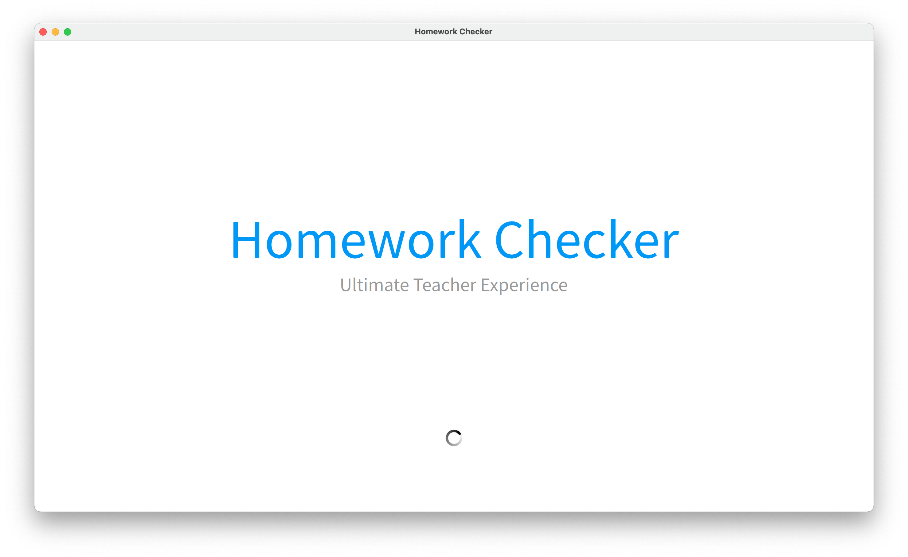

### 注册登录

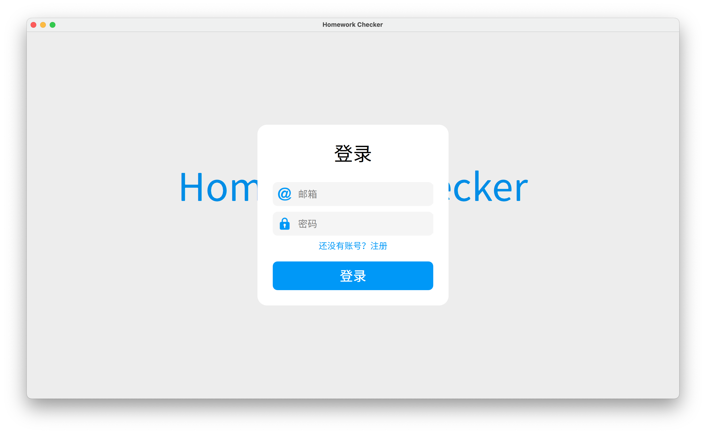

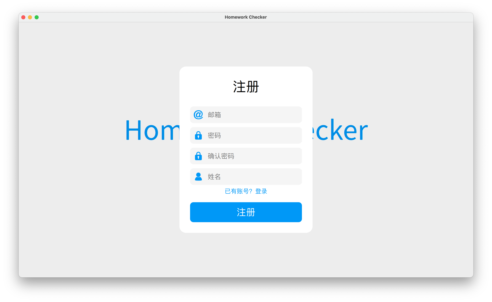

### 总览

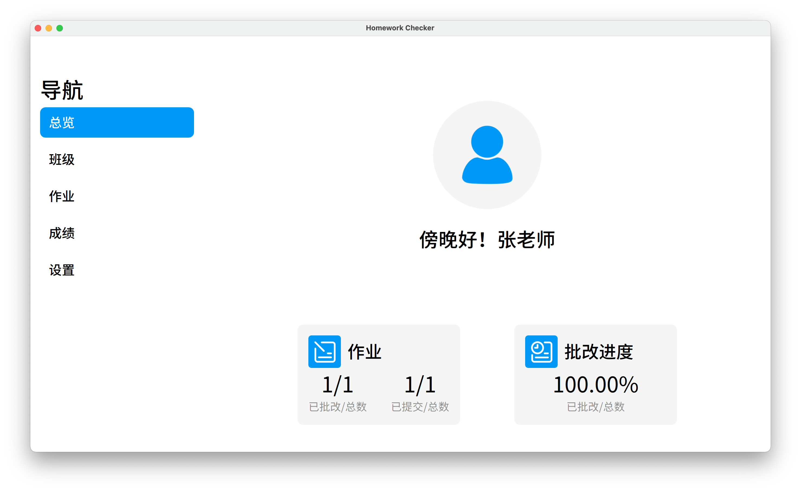

### 班级

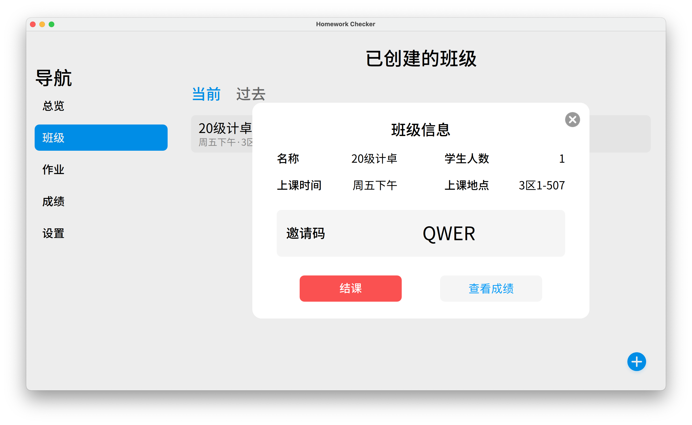

### 作业

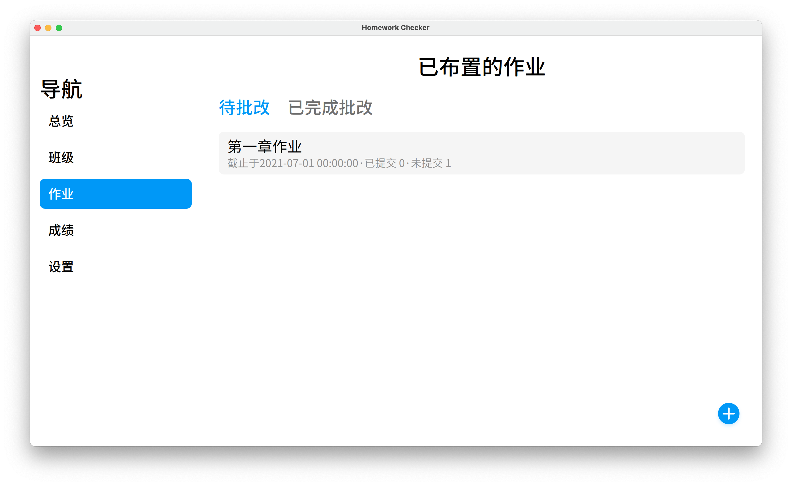

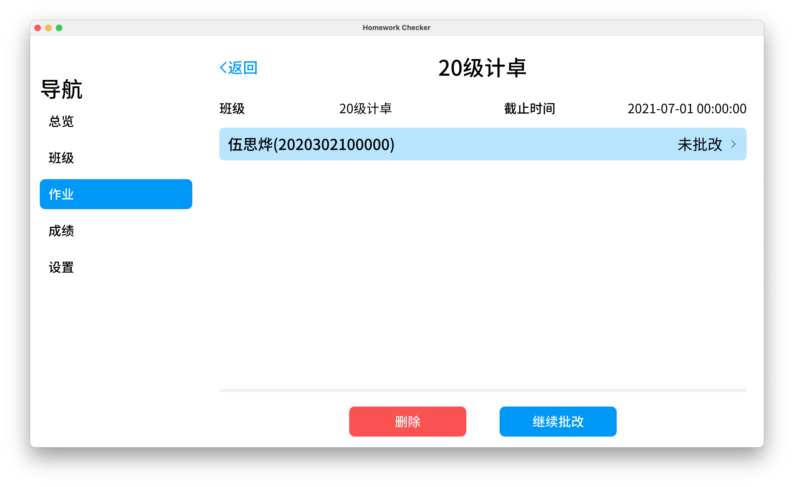

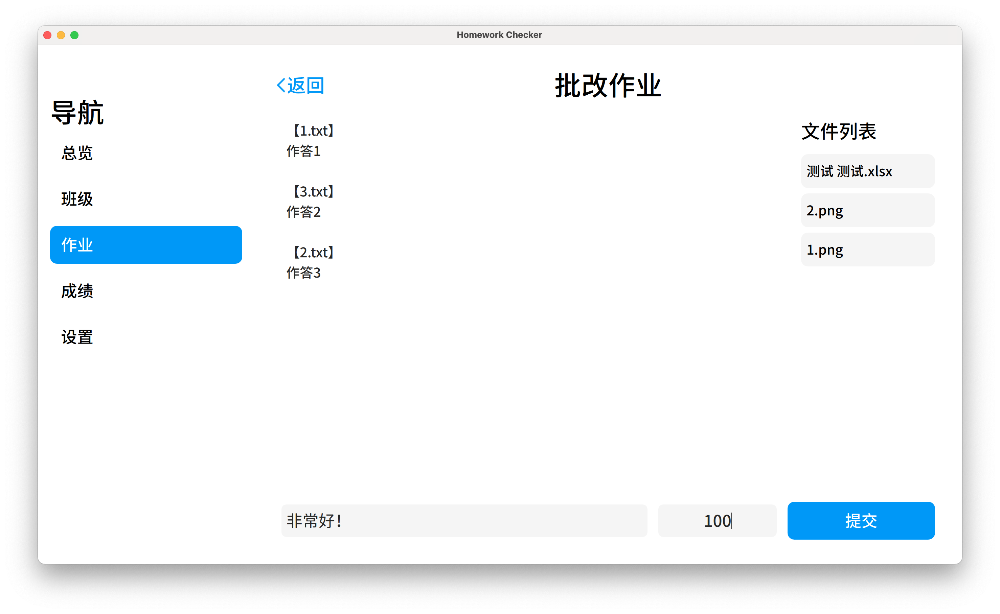

### 成绩

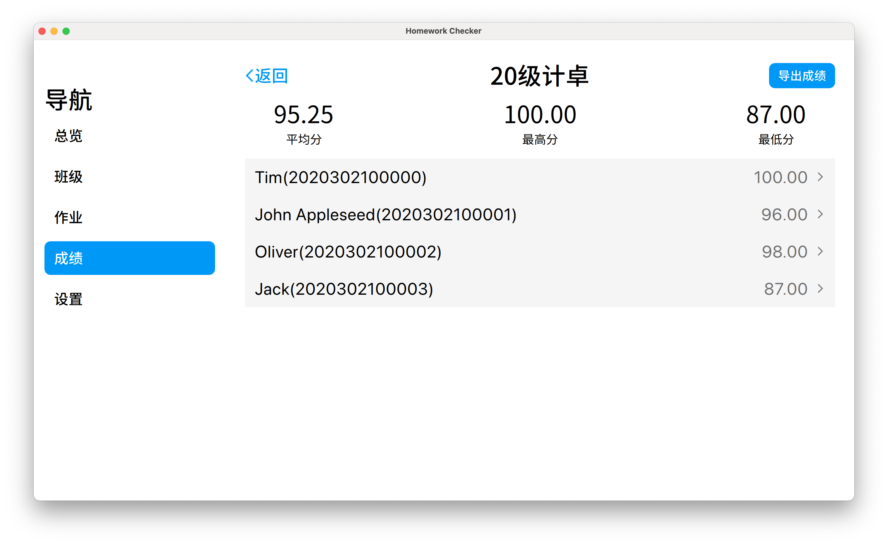

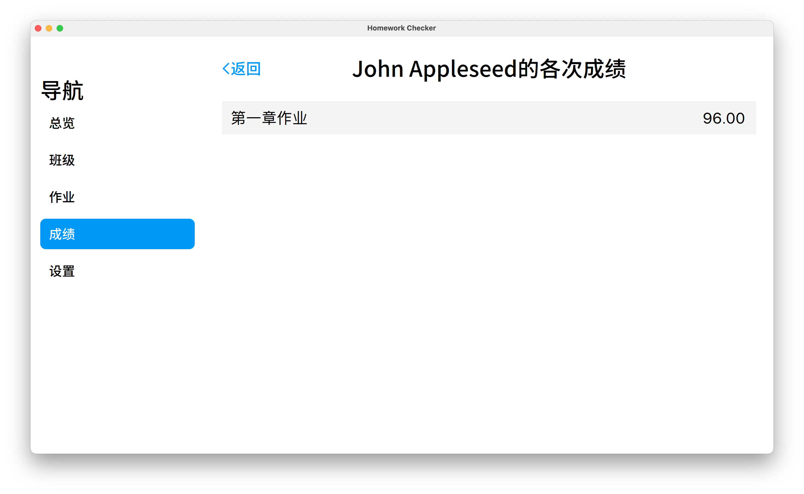

导出的成绩表格

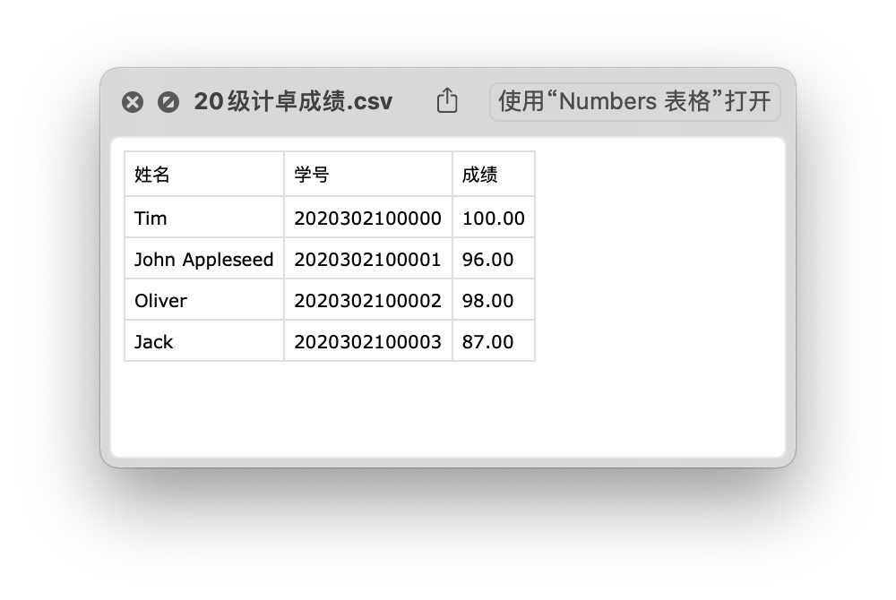

### 设置

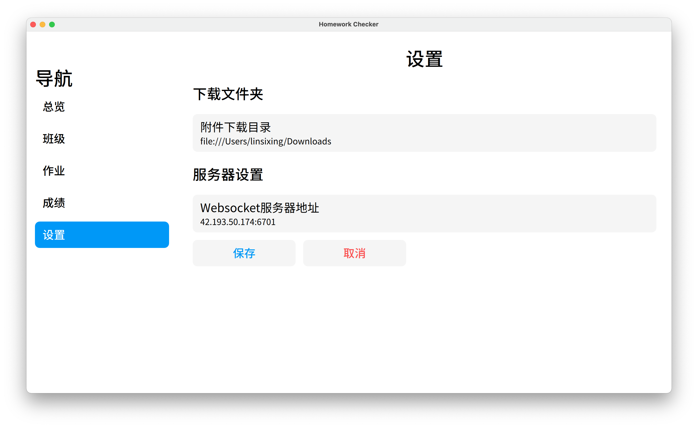

## 补充说明

### 协作开发

本次大作业采用Git进行版本控制和协作开发。项目仓库地址：[https://github.com/NagisaCo/HomeworkChecker.git](https://github.com/NagisaCo/HomeworkChecker.git)

### 内存使用

教师端在macOS下使用Xcode的Instrument工具进行了内存Profile，未发现内存泄漏，瞬时最大内存使用量约141MB，平均使用量约106MB。详情可见`Documents/Analysis/MemoryTrace.trace`

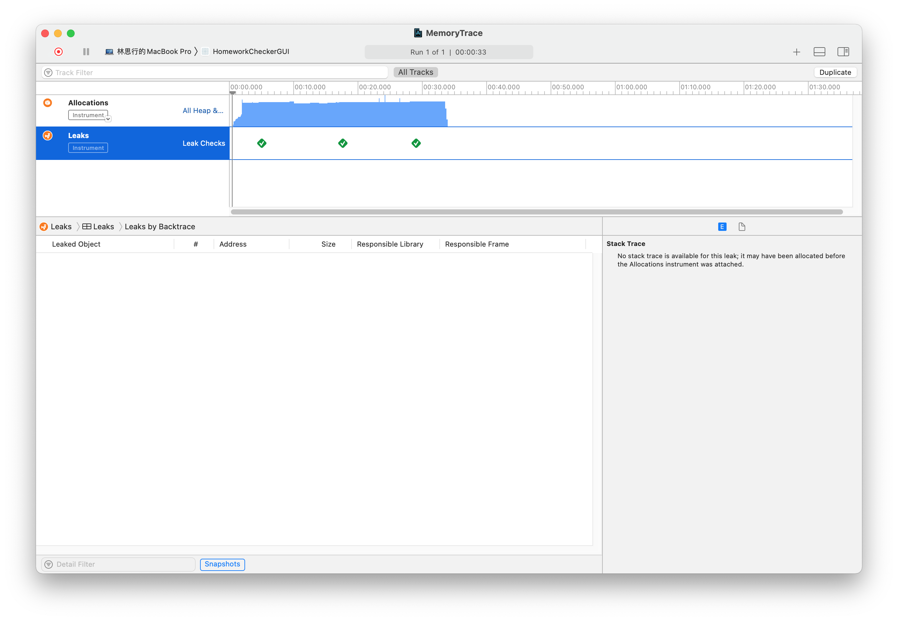

