# HomeworkCheckerServer

## 整体功能

服务端启动程序，主要调用QQMessage模块

## 项目结构

### 引用
- QQMessage

### 整体构成

```
HomeworkCheckerServer           服务端项目  负责人：杨锦荣
├─ CMakeLists.txt               CMake编译文件
└─ HomeworkCheckerServer.cpp    服务端程序
```

### 组件依赖
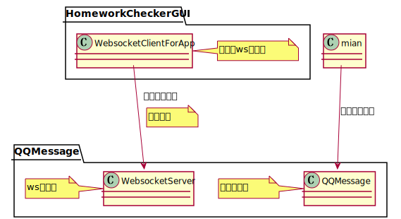

## 运行截图

### 软件运行
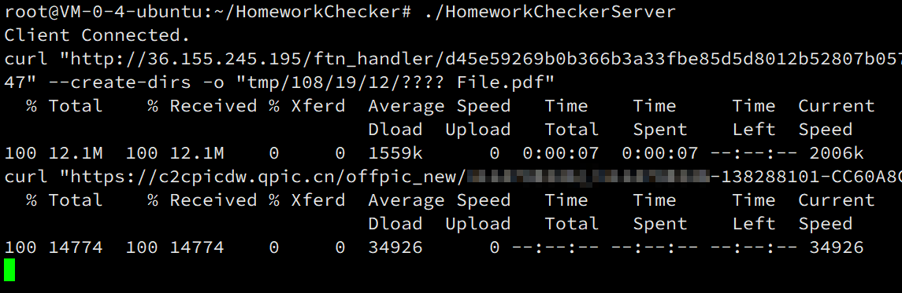  

### QQ端交互

#### 注册

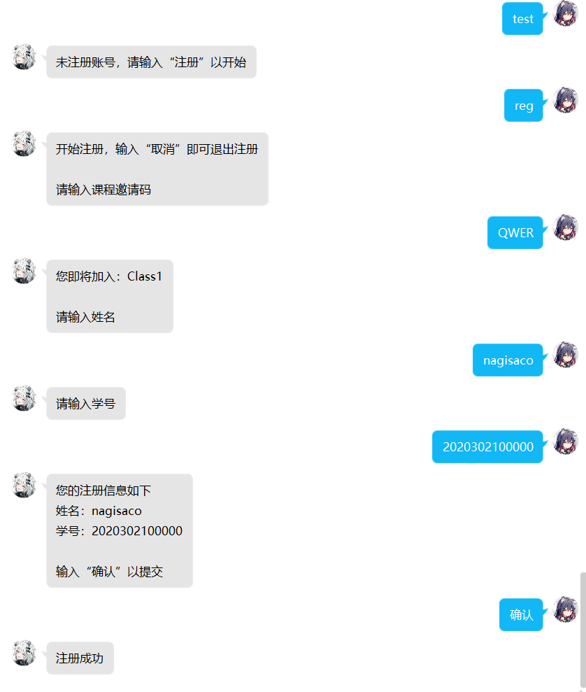  

#### 查询作业

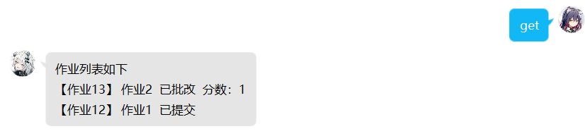  

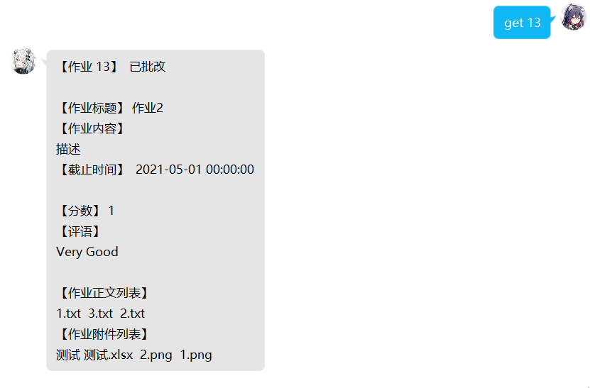  

#### 提交作业

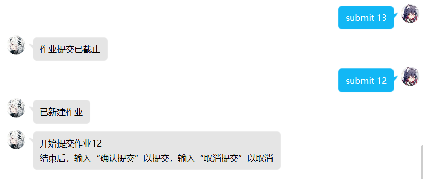  

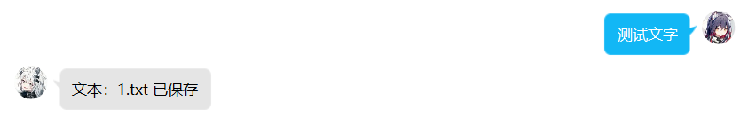  

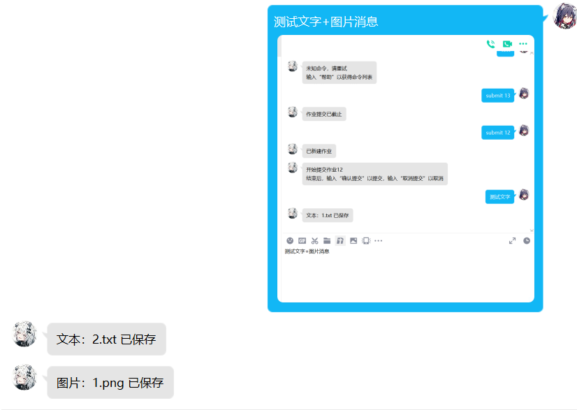  

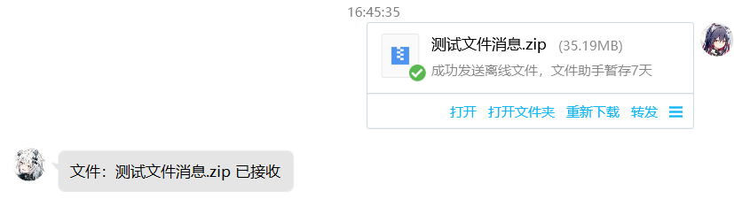  

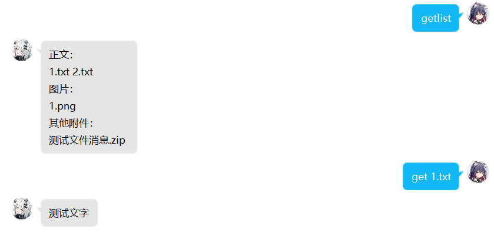  

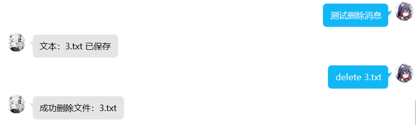  

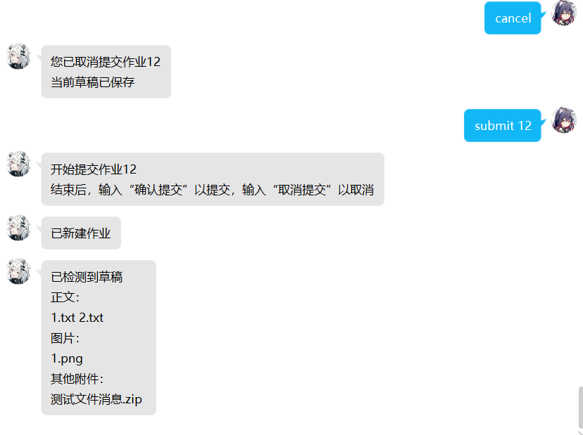  

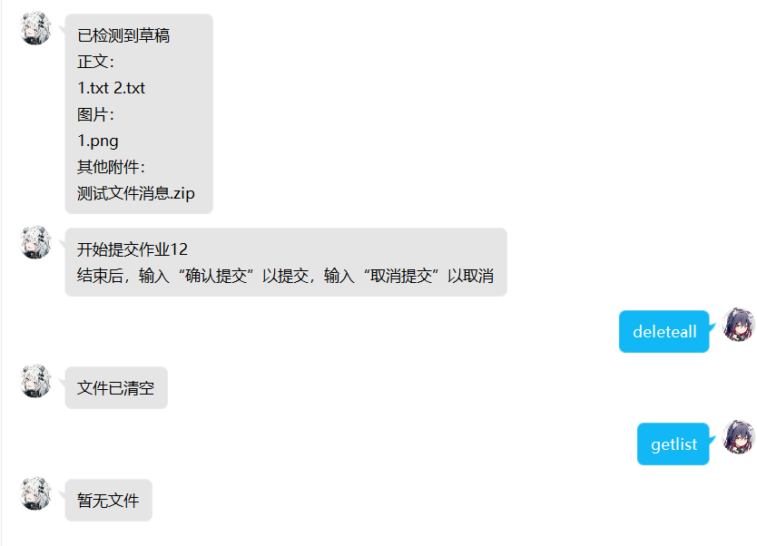  

  

#### 新消息主动提醒

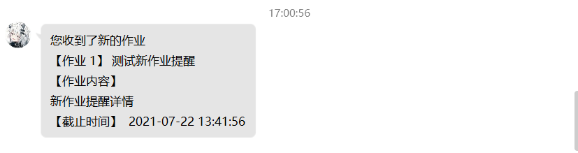  

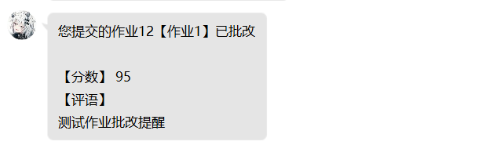  