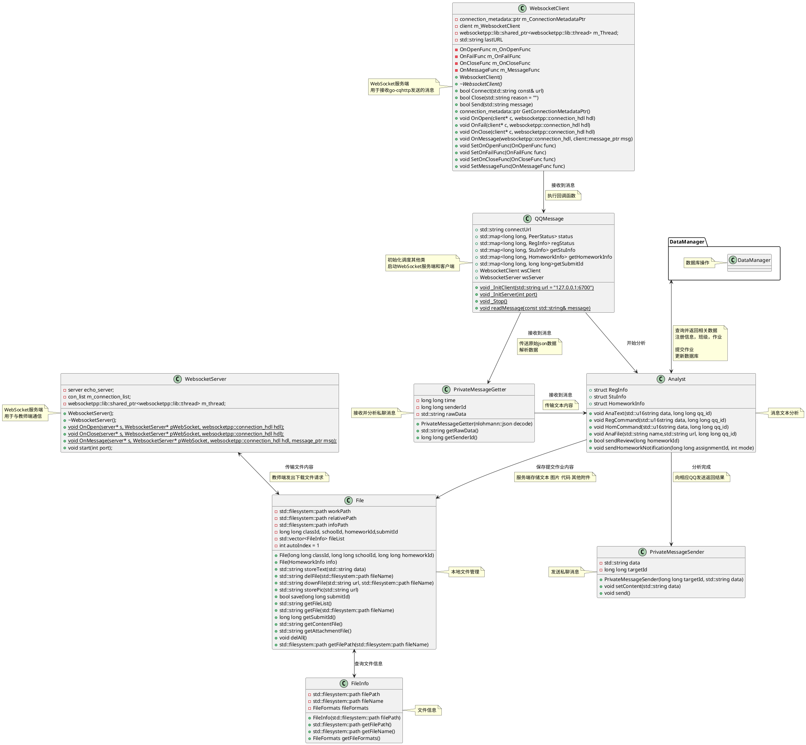
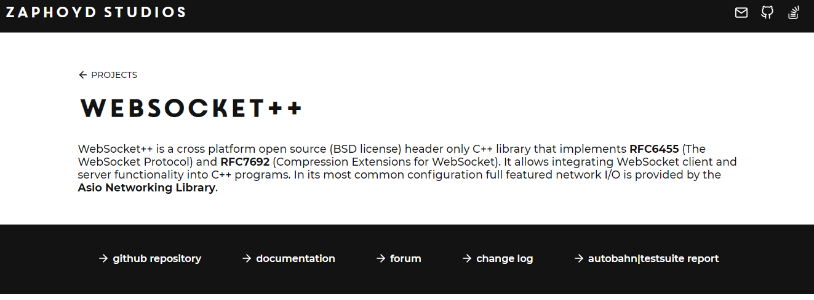

# QQMessage

## 整体功能
接收来自go-cqhttp发送的websocket消息，对qq收到的私聊消息进行命令分析，返回响应文本，接收作业提交内容，存储到服务器中并更新数据库。

## 项目结构

## 引用
- DataManager
- json *(third-party library)*
- websocketpp *(third-party library)*
- asio *(third-party library)*
- mysql *(third-party library)*

### 整体构成
```
QQMessage               QQ消息处理程序  负责人：杨锦荣
├─ Analyst              文本处理及分析
├─ Exception            自定义异常类
├─ File                 本地文件管理类
├─ FileInfo             文件信息类
├─ PrivateMessageGetter 接收私聊消息类
├─ PrivateMessageSender 发送私聊消息类
├─ QQMessage            QQ消息处理主程序 
├─ Tools                工具包
├─ WebsocketClient      WebSocket客户端
└─ WebsocketServer      WebSocket服务端
```

### 组件依赖


## 关键技术

>QQMessage模块作为服务端的核心构成，需要对接收到的消息进行处理分析，并与教师端App进行通讯

### WebSocket技术

WebSocket作为在单个TCP连接上进行的全双工通信，有效的克服了HTTP协议通讯发起的单向性，避免使用轮询，提高通信效率。

- 第三方库选择
由于目前C++17标准库中并没有网络库，需要使用Asio网络库，作为boost库中优秀的一部分，现以可以在C++17下单独使用，不再依赖于boost。基本网络库之上选择了[websocketpp](https://github.com/zaphoyd/websocketpp)，根据使用文档和相关例程简化websocket服务端与客户端，同时引入多线程避免网络通信时阻塞主线程。  


- 多线程
  在编写网络通信部分时，会发现由于网络传输的速度远低于访存操作，当接受或发送大量数据时无法同时解析qq消息文本，会造成服务的中断，于是需引入异步编程与多线程技术。

  利用asio和c++标准库中的多线程技术，实现了websocket服务端和客户端独立于主线程运行，并在程序退出时终止其他线程。
  ```cpp
  m_Thread = websocketpp::lib::make_shared<websocketpp::lib::thread>(&client::run, &m_WebsocketClient);
  ```
  ```cpp
  m_Thread->join();
  ```

- 定义json传输规范
  服务端与客户端通信内容实用json编码，便于解析数据。

  设计时分析双端通信需求，简要列出关键数据及key值
  ```txt
  [action] send_review get_file send_file_info send_file heartbeat send_notification
  send_review:
    send: [homeword_id] 
    return: [homeword_id] [status]"success"/"fail"
  get_file:
    [homework_id]
	[file_name]
  send_file
	[transfer_id]
	[part]
	[content]
	{
		"action": "send_file",
		"transfer_id": "10254",
		"homework_id": "19",
		"name": "1.png",
		"totol_part": "2",
		"part_size": "1048576",
		"size": "1128402",
		"status ": "start "
	}
  heartbeat
  send_notification:
	[type] new_homework
  ```
- 文件传输分块
  依据websocket的特性，在websocket之上可以一次性发送大量数据，但是实际操作中服务端发送大量数据，客户端在接受过程中由于长时间未响应会造成连接异常中断，导致数据传输不完整。所有要在应用层对所发送文件进行分块，根据分块顺序上传至客户端。

  - 接收到传输文件指令，获取文件本地路径及文件信息
    ```cpp
    File file(st.getClassId(), st.getId(), as.getId());
    std::string fileName = decode.at("file_name");
	```
  - 准备缓冲区，将文件分段存入内存
	```cpp
	std::ifstream ifs(file.getFilePath(fileName), std::ios::binary);
    ifs.seekg(0, ifs.end);
    int length = (int)ifs.tellg();
    if (ifs) {
        ifs.seekg(0, ifs.beg);
        std::string buffer(BUFFER_SIZE, '\0');
        int offset = 0;
        int readSize = std::min(BUFFER_SIZE, length - offset);
        while (readSize > 0 && ifs.read(&buffer[0], readSize)) {
            fileContent.push_back(buffer);
            offset += readSize;
            readSize = std::min(BUFFER_SIZE, length - offset);
            }
        }
    ifs.close();
	```
  - 发送文件分块传输初始化信息
  - 依次发送分段数据
  - 传输结束后发送结束消息

### Analyst分析模块
该模块是整个QQMessage模块内逻辑关系最为复杂的一个部分，整体采用面向过程的方法进行编写，对QQ接收到的消息进行切分，识别相应指令并按照需求进行回应。

- 分阶段处理消息
  设计时对学生输入命令的全过程进行详细的分析，确定关键的命令列表，将学生操作模式分为：未注册、空闲、注册中、提交作业中，四种状态。本地保存学生的各种状态信息，确保在一个消息结束后可以正常执行操作流程。

  ```cpp
  extern std::map<long long, PeerStatus> status;
  extern std::map<long long, RegInfo> regStatus;
  ```
- 本地缓存学生信息
  由于测试时网络连接不稳定，访问服务器耗时较大，同时对服务器造成巨大开销。为减少服务器访问次数，对学生的关键信息进行本地保存，兼顾数据时效性的前提下尽可能缓存频繁使用的数据。

```cpp
/// <summary>
/// 学生信息
/// </summary>
struct StuInfo
{
	/// <summary>
	/// 学生id
	/// </summary>
	long long studentId;
	/// <summary>
	/// 学号
	/// </summary>
	long long studentNum;
	/// <summary>
	/// 班级id
	/// </summary>
	long long classId;
};

/// <summary>
/// 作业提交详情
/// </summary>
struct HomeworkInfo
{
	/// <summary>
	/// 学生id
	/// </summary>
	long long studentId;
	/// <summary>
	/// 学号
	/// </summary>
	long long studentNum;
	/// <summary>
	/// 班级id
	/// </summary>
	long long classId;

	/// <summary>
	/// 作业id
	/// </summary>
	long long homeworkId;
	/// <summary>
	/// 提交id
	/// </summary>
	long long submitId;
};
```

### 跨平台适配

- 文件编码统一UTF-8
  在跨平台开发时(Win Mac Linux)，Win下的GBK文件编码导致发送中文消息时产生乱码。于是统一文件编码为UTF-8，并且在处理中文字符串时注明u8标识符。

- 中文字符串采用u16string与u16char类型
  由于Windows与Linux下c++宽字符(wchar)的长度不统一，导致对字符串split操作时需要考虑wchar的两种大小。于是选用c++较新支持的u16string类型，减少不同平台的适配。

- 宏定义区分不同平台
  软件需要使用部分系统函数，需要根据win和linux具体的情况进行适配，了解不同系统的库差异。
```cpp
std::string File::downFile(std::string url, std::filesystem::path fileName)
{
	if (std::filesystem::exists(workPath / fileName))
	{
		fileName = fileName.stem().string() + std::to_string(Tools::getTimestamp()) + "." + fileName.string().substr(fileName.string().find_last_of(".") + 1);
	}
	try
	{
#if defined(WIN32) || defined(_WIN32) || defined(__WIN32) && !defined(__CYGWIN__)
#include <Windows.h>
#pragma comment(lib, "urlmon.lib")
		URLDownloadToFile(NULL, stringToLPCWSTR(url), stringToLPCWSTR((workPath / fileName).string()), 0, NULL);
#else
		std::string file=(workPath / fileName).string();
		std::string comm="curl \""+url+"\" --create-dirs -o \""+file+"\"";
		std::cout << comm<<std::endl;
		system(comm.c_str());
#endif
		return fileName.string();
	}
	catch (...)
	{
		return "";
	}
}
```
  - 处理服务端与客户端中文不同编码方式
    由于不同系统采用GBK和UTF-8不同编码方式，对本地文件进行操控时需要适配客户端与服务端分别采用GBK和UTF-8多种情况。程序内部统一UTF-8编码，在进行本地文件读写时进行编码转换。

  - 编写CMake文件，实现跨平台编译
```cmake
cmake_minimum_required(VERSION 3.8)
project(QQMessage)
set(CMAKE_BUILD_TYPE "Debug")
add_definitions(-std=c++17)
aux_source_directory(. DIR_SRCS)
link_directories(
/usr/lib/x86_64-linux-gnu
../DataManager/DataManager/build
)
include_directories(
/usr/local/lib
/usr/include/mysql
../packages/asio/include
../packages/json
../packages/websocketpp/include
../DataManager/DataManager
)
add_library(QQMessage STATIC ${DIR_SRCS})
target_link_libraries(QQMessage libmysqlclient.so libDataManager.a)
```

## 总结

通过负责该模块的设计与编写，了解了网络编程与数据库的操作，学习了C++的异常机制，实现了多线程编程，并且对较复杂的过程分析的能力有一定提升。

C++下第三方库的使用，由于缺少较成熟的包管理，大多数库文件需要下载源码本地编译，并且自己添加include path和library path，管理库依赖。经历许多的链接错误，全面深刻的了解了头文件的作用，以及静态链接、符号重定位的过程。

由于时间和能力限制，本模块还有许多不足之处
- 设计时类间过于复杂，导致编写程序时过于繁琐
- 缓存设计不规范，后续学习中了解到规范的多路组相联缓存设计和LRU、LFU算法，同时缓存实现可以放入DataManager模块，减少模块间耦合程度
- 异常处理并未完善，没有对不同异常进行分情况处理。很多时候捕获异常只是为了防止程序中断
- 服务端配置信息未进行离线化本地保存，修改ws地址和端口需对程序源码修改
- 分块文件上传模块只有基本功能，没有实现文件校验、乱序传输、断点续传等实用功能