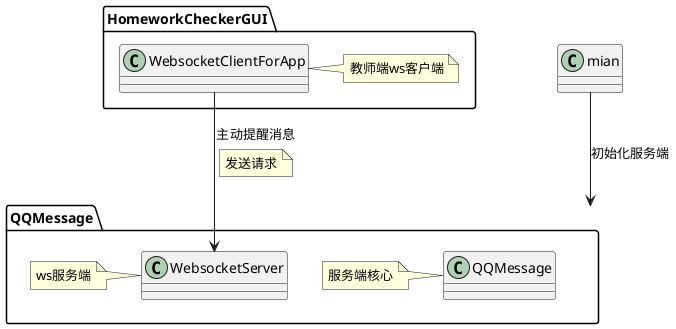

```plantuml
@startuml
package QQMessage
{
    class QQMessage
    note left: 服务端核心

    class WebsocketServer
    note left: ws服务端
}

package HomeworkCheckerGUI
{
    class WebsocketClientForApp
    note right: 教师端ws客户端
}
WebsocketClientForApp --> WebsocketServer : 主动提醒消息
note on link : 发送请求
mian --> QQMessage : 初始化服务端
@enduml
```