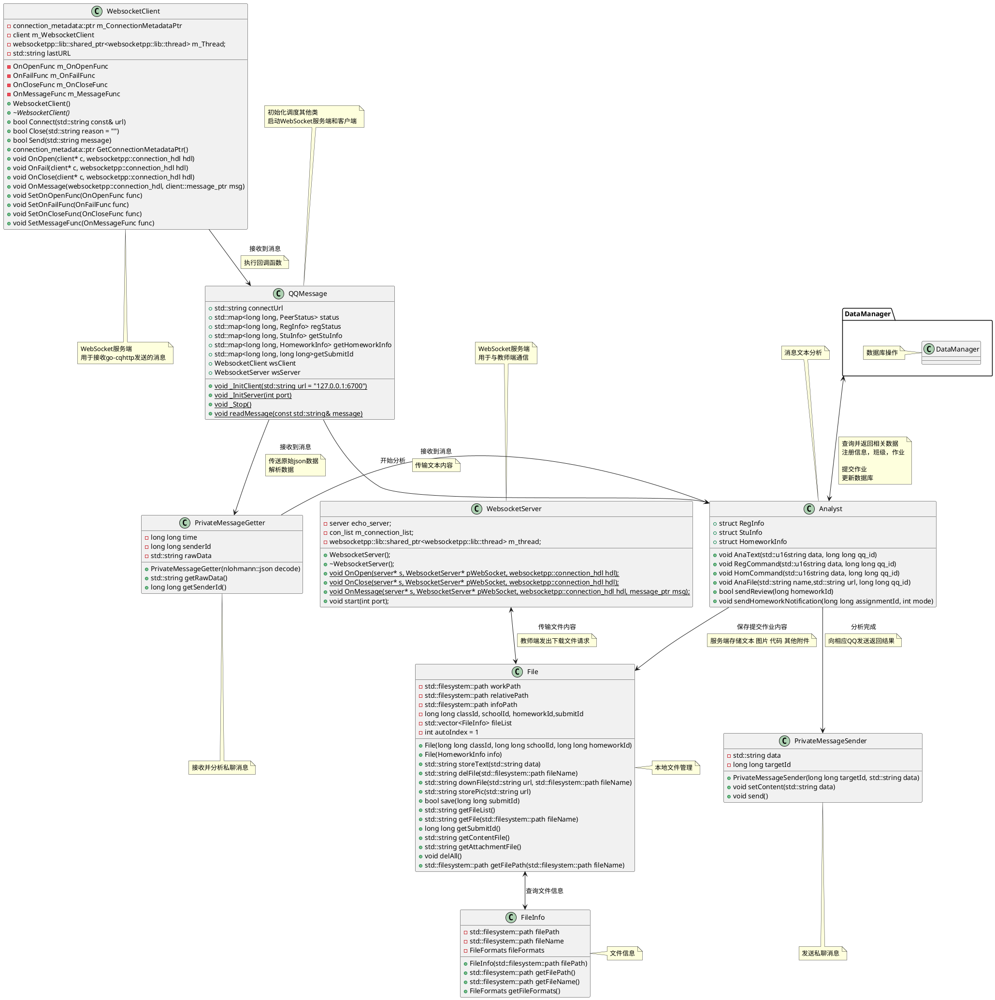

```plantuml
@startuml
package DataManager
{
    class DataManager
    note left: 数据库操作
}

class QQMessage
{
    + {static} void _InitClient(std::string url = "127.0.0.1:6700")
	+ {static} void _InitServer(int port)
	+ {static} void _Stop()
    + {static} void readMessage(const std::string& message)
	+ std::string connectUrl
	+ std::map<long long, PeerStatus> status
	+ std::map<long long, RegInfo> regStatus
	+ std::map<long long, StuInfo> getStuInfo
	+ std::map<long long, HomeworkInfo> getHomeworkInfo
	+ std::map<long long, long long>getSubmitId
	+ WebsocketClient wsClient
	+ WebsocketServer wsServer
}
note top: 初始化调度其他类\n启动WebSocket服务端和客户端

class WebsocketClient
{
    - connection_metadata::ptr m_ConnectionMetadataPtr
	- client m_WebsocketClient
	- websocketpp::lib::shared_ptr<websocketpp::lib::thread> m_Thread;
	- std::string lastURL
	{method}- OnOpenFunc m_OnOpenFunc
	{method}- OnFailFunc m_OnFailFunc
	{method}- OnCloseFunc m_OnCloseFunc
	{method}- OnMessageFunc m_MessageFunc
    + WebsocketClient()
	+ {abstract} ~WebsocketClient()
	+ bool Connect(std::string const& url)
	+ bool Close(std::string reason = "")
	+ bool Send(std::string message)
	+ connection_metadata::ptr GetConnectionMetadataPtr()
	+ void OnOpen(client* c, websocketpp::connection_hdl hdl)
	+ void OnFail(client* c, websocketpp::connection_hdl hdl)
	+ void OnClose(client* c, websocketpp::connection_hdl hdl)
	+ void OnMessage(websocketpp::connection_hdl, client::message_ptr msg)
	+ void SetOnOpenFunc(OnOpenFunc func)
	+ void SetOnFailFunc(OnFailFunc func)
	+ void SetOnCloseFunc(OnCloseFunc func)
	+ void SetMessageFunc(OnMessageFunc func)
}
note bottom: WebSocket服务端\n用于接收go-cqhttp发送的消息

class WebsocketServer
{
    + WebsocketServer();
    + ~WebsocketServer();
    + {static} void OnOpen(server* s, WebsocketServer* pWebSocket, websocketpp::connection_hdl hdl);
    + {static} void OnClose(server* s, WebsocketServer* pWebSocket, websocketpp::connection_hdl hdl);
    + {static} void OnMessage(server* s, WebsocketServer* pWebSocket, websocketpp::connection_hdl hdl, message_ptr msg);
    + void start(int port);

    - server echo_server;
    - con_list m_connection_list;
    - websocketpp::lib::shared_ptr<websocketpp::lib::thread> m_thread;
}
note top: WebSocket服务端\n用于与教师端通信

class PrivateMessageGetter
{
    - long long time
    - long long senderId
    - std::string rawData

    + PrivateMessageGetter(nlohmann::json decode)
    + std::string getRawData()
    + long long getSenderId()
}
note bottom: 接收并分析私聊消息

class PrivateMessageSender
{
	- std::string data
	- long long targetId

	+ PrivateMessageSender(long long targetId, std::string data)
	+ void setContent(std::string data)
	+ void send()
}
note bottom: 发送私聊消息

class Analyst
{
    + struct RegInfo
    + struct StuInfo
    + struct HomeworkInfo

    + void AnaText(std::u16string data, long long qq_id)
    + void RegCommand(std::u16string data, long long qq_id)
    + void HomCommand(std::u16string data, long long qq_id)
    + void AnaFile(std::string name,std::string url, long long qq_id)
    + bool sendReview(long homeworkId)
    + void sendHomeworkNotification(long long assignmentId, int mode)
}
note top: 消息文本分析

class File
{
	- std::filesystem::path workPath
	- std::filesystem::path relativePath
	- std::filesystem::path infoPath
	- long long classId, schoolId, homeworkId,submitId
	- std::vector<FileInfo> fileList
	- int autoIndex = 1

	+ File(long long classId, long long schoolId, long long homeworkId)
	+ File(HomeworkInfo info)
	+ std::string storeText(std::string data)
	+ std::string delFile(std::filesystem::path fileName)
	+ std::string downFile(std::string url, std::filesystem::path fileName)
	+ std::string storePic(std::string url)
	+ bool save(long long submitId)
	+ std::string getFileList()
	+ std::string getFile(std::filesystem::path fileName)
	+ long long getSubmitId()
	+ std::string getContentFile()
	+ std::string getAttachmentFile()
	+ void delAll()
	+ std::filesystem::path getFilePath(std::filesystem::path fileName)
}
note right: 本地文件管理

class FileInfo
{
	- std::filesystem::path filePath
	- std::filesystem::path fileName
	- FileFormats fileFormats

	+ FileInfo(std::filesystem::path filePath)
	+ std::filesystem::path getFilePath()
	+ std::filesystem::path getFileName()
	+ FileFormats getFileFormats()
}
note right: 文件信息

WebsocketClient --> QQMessage: 接收到消息
note on link : 执行回调函数
QQMessage --> PrivateMessageGetter: 接收到消息
note on link : 传送原始json数据\n解析数据

QQMessage --> Analyst : 开始分析
PrivateMessageGetter -> Analyst: 接收到消息
note on link : 传输文本内容

Analyst --> PrivateMessageSender : 分析完成
note on link : 向相应QQ发送返回结果

Analyst --> File : 保存提交作业内容
note on link : 服务端存储文本 图片 代码 其他附件

File <--> FileInfo : 查询文件信息

WebsocketServer <--> File: 传输文件内容
note on link : 教师端发出下载文件请求

DataManager <--> Analyst
note on link : 查询并返回相关数据\n注册信息，班级，作业\n\n提交作业\n更新数据库
@enduml
```